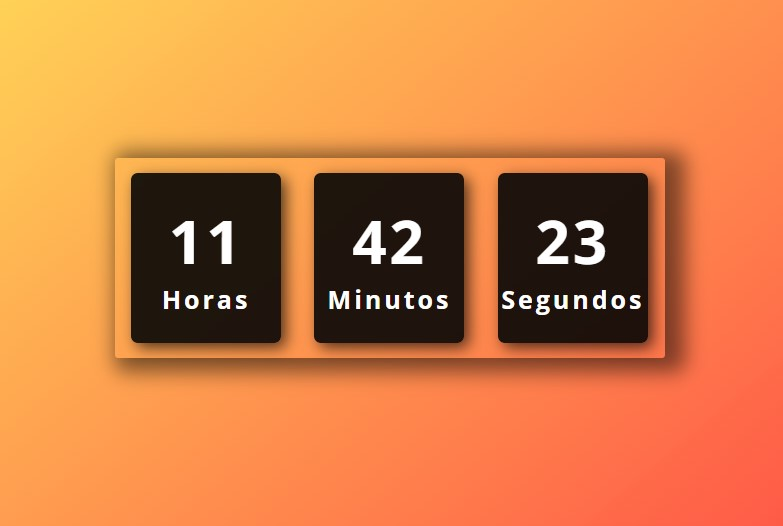

# Relógio Digital Online

## Descrição

Este projeto é um relógio digital simples construído com **HTML**, **CSS** e **JavaScript**. Ele exibe a hora atual em formato `horas:minutos:segundos` e atualiza automaticamente a cada segundo \o/.

## Tecnologias Utilizadas

- HTML5
- CSS3
- JavaScript

## Instalação e Uso

1. Faça o download do projeto ou clone o repositório do [GitHub](https://github.com/DevAndreLuis/relogio-digital-online.git).
2. Abra o arquivo `index.html` no seu navegador.
3. O relógio digital será exibido automaticamente.

## Personalização

Você pode personalizar a aparência do relógio editando o arquivo `style.css`.

## Observações

- Este projeto foi desenvolvido apenas para fins didáticos.
- Você pode aprimorar este projeto implementando novas funcionalidades, como a exibição da data, alarme ou alteração do formato da hora.

## Contribuição

Se você deseja contribuir com esse projeto, sinta-se à vontade para enviar um pull request no [GitHub](https://github.com/DevAndreLuis/relogio-digital-online/pulls).

## Autor

**4ndreDev**

## Link do Projeto

[Link para o repositório do projeto no GitHub](https://github.com/DevAndreLuis/relogio-digital-online)
[Linkedin](https://www.linkedin.com/in/andr%C3%A9-luis-3073aa2ab/)

## Imagens

## Código

Você pode visualizar o código-fonte do projeto neste repositório.

Espero que goste do projeto!

---

